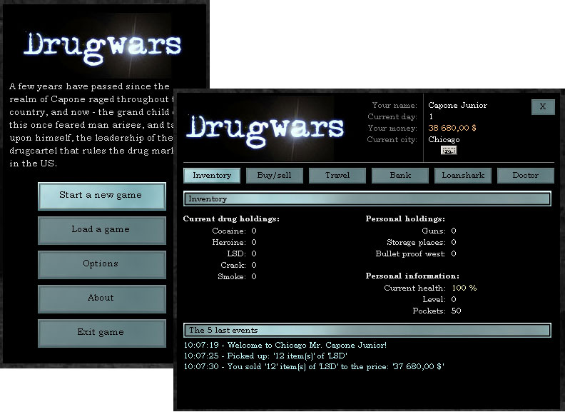

<div align="center">

## Drugwars 2002


</div>

### Description

This is merely an attempt to create a more

advanced version of the game Drugwars that

many of you are familiar with. Through a nice

GUI, a more intelligent code and random events

that makes the game much more fun to play. As

well as interrest rates that goes up and down,

prices that floats and much more. Please note that this is a work in progress, so it's merely just the start of the game. Still quite alot of work to do on it.
 
### More Info
 
IMPORTANT: Rename the npmod32.dl_ to npmod32.dll.

(This DLL is running the music system, instead of

using those huge MP3 files, I chose to use the

old MOD/IT/XM system instead. The sound quality

is quite good, and the file size of the music

files are far smaller than std. MP3.)

FINAL NOTICE: I tried several times to upload

the source and the additional files here at PSC,

but after the 7th attempt, I gave up, so I've

placed the files here instead.

FILESIZE: The total file size for this project

is about 2.5MB.

NOTE: Read the 'keyboard.txt' in order to learn

how to operate the keyboard commands in the game.


<span>             |<span>
---                |---
**Submitted On**   |
**By**             |[Kjell Arne Brudvik](https://github.com/Planet-Source-Code/PSCIndex/blob/master/ByAuthor/kjell-arne-brudvik.md)
**Level**          |Intermediate
**User Rating**    |4.5 (18 globes from 4 users)
**Compatibility**  |VB 5\.0, VB 6\.0
**Category**       |[Games](https://github.com/Planet-Source-Code/PSCIndex/blob/master/ByCategory/games__1-38.md)
**World**          |[Visual Basic](https://github.com/Planet-Source-Code/PSCIndex/blob/master/ByWorld/visual-basic.md)
**Archive File**   |[](https://github.com/Planet-Source-Code/kjell-arne-brudvik-drugwars-2002__1-39195/archive/master.zip)

### API Declarations

```
(note that you need all 3 modules in order for
the game to work)
```


### Source Code

```
NEW URL (20th July 2006)
http://brudvik.mine.nu/vb/Drugwars2002.zip
```

